# Proving and verifying correct computation of the Fast Fourier Transform
This example is meant to demonstrate the power of permutation checks in efficiently proving the correct computation of a program with data-oblivious, but variable accesses. Fast Fourier Transform (FFT) is such a program, as we explain below.
## The iterative FFT function 
This example implements the AIR for a simple iterative FFT using the Cooley-Tukey algorithm. See the [Wikipedia article](https://en.wikipedia.org/wiki/Cooley–Tukey_FFT_algorithm#Data_reordering,_bit_reversal,_and_in-place_algorithms) for more info. Also, see the `fast_fourier_transform` file in the `utils` module of this crate for a simple iterative FFT implementation. 


The reason that implementing iterative FFT is interesting is because it is an algorithm that proceeds in steps, where each step is data-oblivious but has a distinct access pattern from other steps. This pattern is similar to other data oblivious algorithms, such as bitonic sorting and other kinds of algorithms often used as part of cryptographic constructions. 

In particular, iterative FFT implementations consist of the following steps:
```
INPUT: an array integers Arr, with length(Arr) = n = 2^k, omega: an n-th root of unity. 
STEP 0: Mutate Arr by applying the bit reverse permutation.
STEP s: with s = 1 through k - 1: 
    let m = 2^s
    let local_omega = omega^{n/m}
    let jump = m/2
    let segment_size = m
    let number_of_segments = n/m
    for segment_i with i=0 through number_of_segments - 1:
        start_of_segment = m * i
        multiplicative_fac = 1
        for j in 0 through jump - 1:
            u = Arr[start_of_segment + j]
            v = Arr[start_of_segment + jump + j]
            Arr[start_of_segment + j] = u + (multiplicative_fac * v)
            Arr[start_of_segment + jump + j] = u - (multiplicative_fac * v)
            multiplicative fac = multiplicative_fac * local_omenga
    return Arr
```
Note that each step after the 0th step accesses two memory locations at a time, separated by the parameter `jump`.

## Efficiently proving correct run of iterative FFT
### Iterative FFT computation using permutations
When writing an AIR for the iterative FFT program, recall that we would like to minimize the number of distict transition functions. Since it is possible to efficiently verify permutations, we can achieve the reduction in the number of transition functions by separating the calculation steps from steps putting adjacent values next to each other. We explain this below with a running example of running an FFT on 8 inputs. 

#### Step 0:
The 0th step is permuting the array of inputs, applying the bit-reverse permutation. In the example of an 8-input FFT, the inputs are indexed 0 through 7 (both included). Each index is up to 3 bits long and it's reversal is also in the set [0, 7]. For example, the bit reversal of 1 = 001 is 100, hence the element at index 1 gets switched with the element at index 4. See the diagram below, the left verticle array represents the indexed locations of the input and the right verticle array is the bit-reversed permutation.

<p align="center">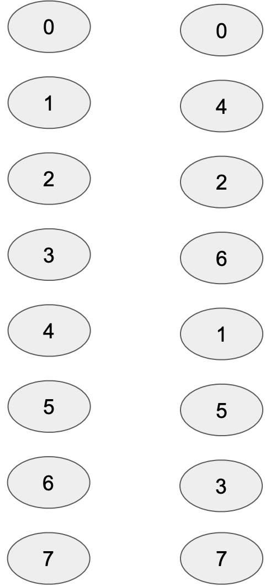</p>

#### Step 1:
The 1st step operates on adjacent indices. For example, the inputs at index 0 and index 1 are considered together and the resulting values are placed in index 0 and 1 respectively. In particular, the updated location, `0*` would contain `val_at_0 + multiplicative_factor * val_at_1` and the location `1*` would contain `val_at_0 + multiplicative_factor * val_at_1`. See diagram below, identically shaped locations are operated together. Hence, step 1 doesn't require any rearranging, since the operated values are already next to each other. 

<p align="center">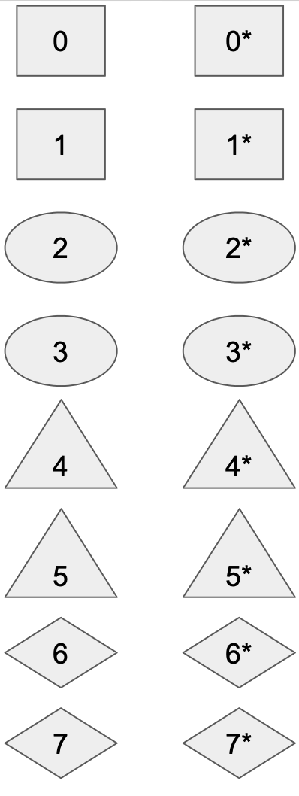</p>

#### Step 2:
The outputs of the previous step will have to be operated on again, but this time, values operated on together are not adjacent. In fact, the elements to be operated together are 2 positions apart. In the diagram below, locations represented in identical shapes are operated on together. In the diagram below, the left array represents the original ordering when the previous step completed. The right array shows the values after they are permuted. In the code, we call these the `fft permutation`s at this step.

<p align="center">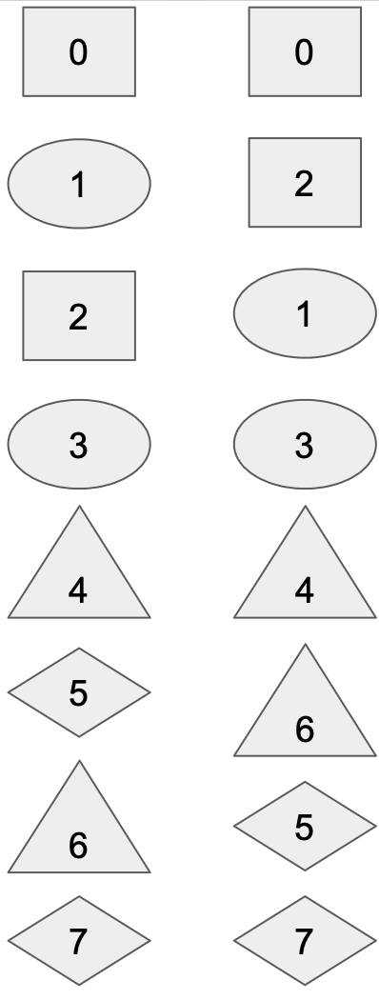</p>

#### Step 3:
After the rearrangement from the previous step, values to be operated on together are again next to each other. The same operation as in step 1 can now be applied with appropriate multiplicative factors. 

<p align="center">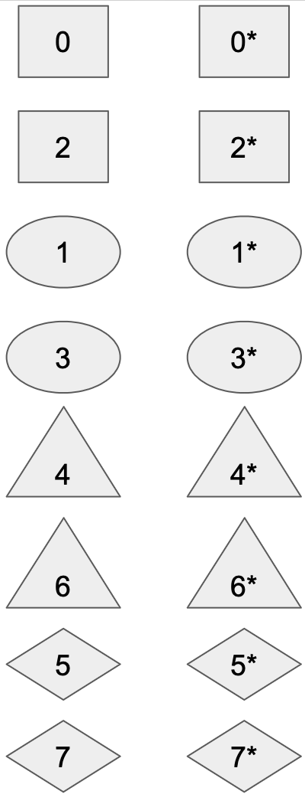</p>

#### Step 4:
The previous re-arrangement from step 2 is preserved after the operation in step 3. It must be undone before the next permutation to bring adjacent elements together can be applied. In the code, we call these the `reverse fft permutation`s at this step. 

<p align="center"></p>

#### Step 5:
Now, we rearrange the array to put values to be operated on together again. This time the values operated on together are 4 positions apart. 

<p align="center">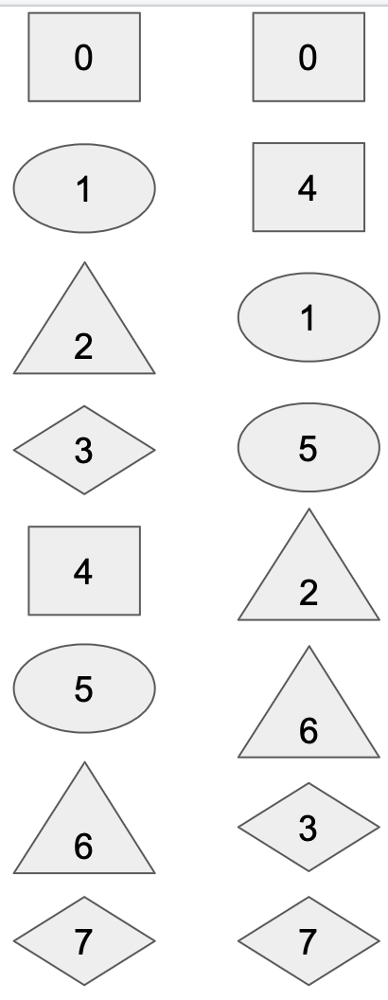</p>

#### Step 6:
Now another round of FFT operations with the correct multiplicative factors can be applied.  
<p align="center">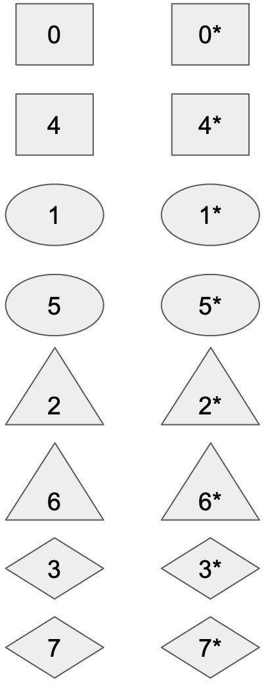</p>

#### Step 7:
Finally, we reverse the permutation from step 5 and receive our output.
<p align="center">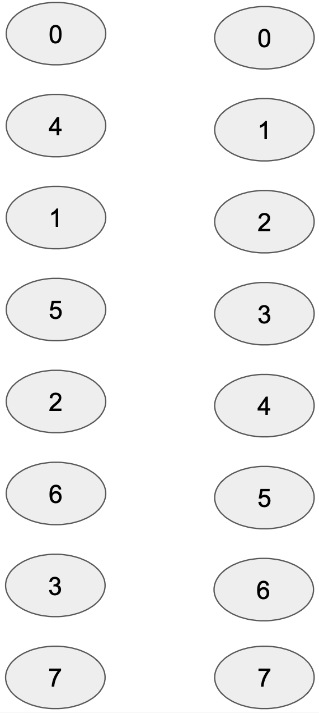</p>

### Constraints for checking correct FFT computation
To verify the correct computation of the above steps, we need to verify the following statements:
1. The initial bit reverse permutation was done correctly. 
2. Each step in the set [1, 3, 6] correctly computed i.e. the correct multiplicative factor was used and adjacent terms were operated on together as in step 1 above.
3. Each step in the set [2, 5] did the correct forward permutation: putting together values that are 2 positions and 5 positions apart, respectively.
4. Each step in the set [4, 7] inverted the permutation in steps 2 and 5 respectively. 

#### Permutation checking
To show that two arrays are (general) permutations of each other can exploit the Schwartz-Zippel Lemma as follows. Suppose two sequences `A = (a_1, ..., a_n)` and `B = (b_1, ..., b_n)` contain all the same elements, i.e. are permutations of each other. Then, with high probability, for `gamma` chosen uniformly at random, the products `(a_1 + gamma)* ...* (a_n + gamma)` and `(b_1 + gamma)* ...* (b_n + gamma)` are equal, and neither is zero. Suppose we define a sequence, `P = (p_1, ..., p_{n+1})` with `p_1 = 1`, for `i >=1`, `p_{i+1} = p_i * [(a_i + gamma)/(b_i + gamma)]`, then, if `A` and `B` indeed contain the same elements,  `p_1 = p_{n+1} = 1`. See [Ariel Gabizon's excellent explanation](https://hackmd.io/@aztec-network/plonk-arithmetiization-air#RAPs---PAIRs-with-interjected-verifier-randomness) for more details on doing such checks.

We quickly reiterate here, that the above explanation can be extended to checking a particular permutation, say, `perm` that takes the `i`th position to the `perm(i)`th position. We do this by first sampling a random `alpha` by replacing `a_i` with `a_i + alpha * perm(i)`, and `b_i` with `b_i + alpha * i`, and doing the same trick as above on the new sets. The explanation linked above and various other resources provide more details on this type of construction.  

Note that since we will be dealing with permutations, we need to be able to access locations as field elements. Thus, we add another step to the computation discussed above which fills an array with values `0-7`. So, 
#### Step 8: 
Populate location `i` with the corresponding field element `i` in the field.

#### Proving correct bit-reverse permutation
To the best of our knowledge, concise algebraic function representation of the bit-reverse permutation is still an open problem. Hence, we introduce another column, which just contains the bit reverse permutation of the sequence of 3-bit integers `0-7` and show that it is indeed the bit-reversal of the sequence. This produces 
#### Step 9: 
Populate location `i` with the field element corresponding to `bit_reverse(i)` in the field.

Now, we can use periodic columns to represent the 3-bit representations of `0-7` and show that the elements contained at each position `i` of the columns filled at steps 8 and 9 are indeed bit reversals of each other. 

Then, we can use these columns, together with the 0th and 1st column to show that step 1 did indeed execute the bit-reverse permutation. 

#### Proving FFT steps
The FFT steps themselves are all simple, essentially, we need to check that the elements at positions `2i` and `2i+1` are correctly updated using a multiplicative factor. We use the periodic columns to keep track of the multiplicative factors at each step. No permutation checking is required here.

### Proving forward and backward permutation
To prove that forward and backward permutations are done correctly, we fortunately have algebraic formulae we could use in conjunction with periodic columns. 

Recall that in the simple FFT algorithm above, at FFT step `s`, the outer loop only accesses contiguous segments of `m = 2^s` elements at a time. The distance between elements accessed together is `jump = m/2`. Since the value at position `start_of_segment + j` and at position `start_of_segment + j + jump` are accessed together, in the forward permutation step, these must end up together. The mapping we end up using is `start_of_segment + j` --> `start_of_segment + 2*j` and `start_of_segment + j + jump` --> `start_of_segment + 2*j + 1`, which allows us to accomodate segment-wise permutations and to have small periodic columns. See the figure below for an illustration:

<p align="center">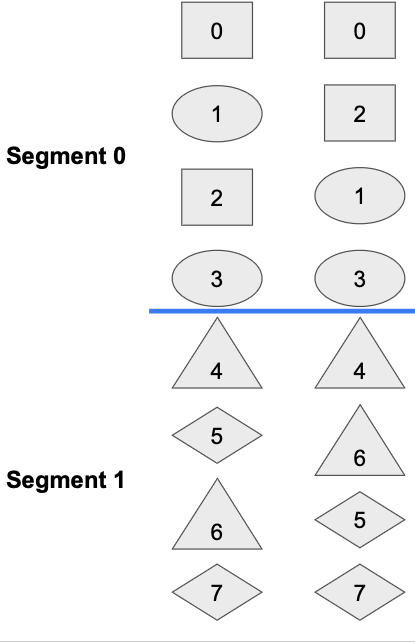</p>

Thus, the forward permutation takes place at steps of the form `3*k + 2` for `k = [0, ..., log(8) - 2]`, i.e. `[3 * 0 + 2, ..., 3*(log(8) - 2) + 2]` and we treat `s`, the parameter used for the permutation as equal to `k + 2` for the corresponding step `3 * k + 2`. 

For each location `loc` in `0-7`, we observe that for a given `s`, 
* `m = 2^s`
* `jump = m/2`
* if `loc % m < jump`, then `permute(loc) = loc + loc % m`; else, `permute(loc) = loc + loc % m - jump + 1`.

This means that for a given `s`, if we had the following periodic columns 
<p align="center">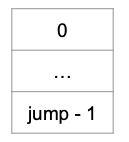</p>

<p align="center">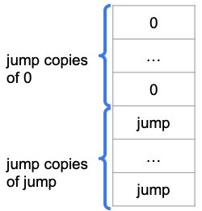</p>

<p align="center">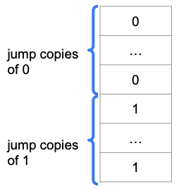</p>

we could use them to calculate the permuted locations for each permutation step. 

A similar resoning works to create the periodic columns and corresponding algebraic expression for the inverse permutation.

### Generalizing FFT using permutation
We can basically generalize this example with exactly the same reasoning.

