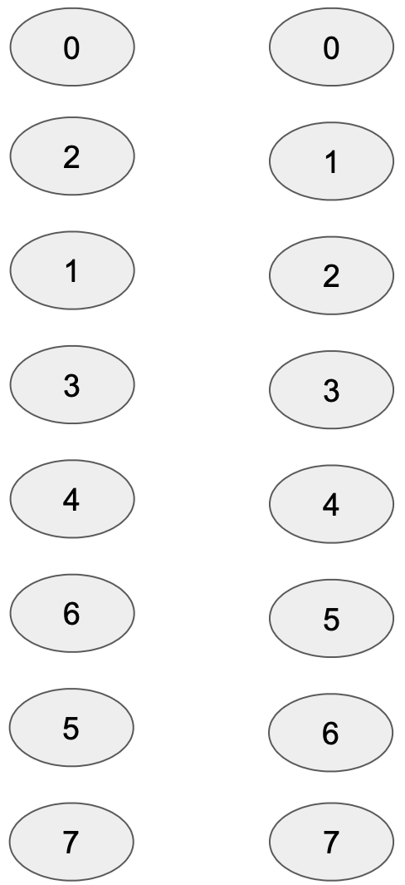

# Iterative FFT function 
This example implements the AIR for a simple iterative FFT using the Cooley-Tukey algorithm. See the [Wikipedia article](https://en.wikipedia.org/wiki/Cooley–Tukey_FFT_algorithm#Data_reordering,_bit_reversal,_and_in-place_algorithms) for more info. Also, see the `fast_fourier_transform` file in the `utils` module of this crate for a simple iterative FFT implementation. 


The reason that implementing iterative FFT is interesting is because it is an algorithm that proceeds in steps, where each step is data-oblivious but has a distinct access pattern from other steps. This pattern is similar to other data oblivious algorithms, such as bitonic sorting and other kinds of algorithms often used as part of cryptographic constructions. 

In particular, iterative FFT implementations consist of the following steps:
```
INPUT: an array integers Arr, with length(Arr) = n = 2^k, omega: an n-th root of unity. 
STEP 0: Mutate Arr by applying the bit reverse permutation.
STEP s: with s = 1 through k - 1: 
    let m = 2^s
    let local_omega = omega^{n/m}
    let jump = m/2
    let segment_size = m
    let number_of_segments = n/m
    for segment_i with i=0 through number_of_segments - 1:
        start_of_segment = m * i
        multiplicative_fac = 1
        for j in 0 through jump - 1:
            u = Arr[start_of_segment + j]
            v = Arr[start_of_segment + jump + j]
            Arr[start_of_segment + j] = u + (multiplicative_fac * v)
            Arr[start_of_segment + jump + j] = u - (multiplicative_fac * v)
            multiplicative fac = multiplicative_fac * local_omenga
    return Arr
```
Note that each step after the 0th step accesses two memory locations at a time, separated by the parameter `jump`.

# Iterative FFT using permutations
When writing an AIR for the iterative FFT program, recall that we would like to minimize the number of distict transition functions. Since it is possible to efficiently verify permutations, we can achieve the reduction in the number of transition functions by separating the calculation steps from steps putting adjacent values next to each other. We explain this below with a running example of running an FFT on 8 inputs. 

### Step 0:
The 0th step is permuting the array of inputs, applying the bit-reverse permutation. In the example of an 8-input FFT, the inputs are indexed 0 through 7 (both included). Each index is up to 3 bits long and it's reversal is also in the set [0, 7]. For example, the bit reversal of 1 = 001 is 100, hence the element at index 1 gets switched with the element at index 4. See the diagram below, the left verticle array represents the indexed locations of the input and the right verticle array is the bit-reversed permutation.

<p align="center"></p>

### Step 1:
The 1st step operates on adjacent indices. For example, the inputs at index 0 and index 1 are considered together and the resulting values are placed in index 0 and 1 respectively. See diagram below, identically shaped locations are operated together. Hence, step 1 doesn't require any rearranging, since the operated values are already next to each other. 

<p align="center"></p>

### Step 2:
The outputs of the previous step will have to be operated on again, but this time, values operated on together are not adjacent. In fact, the elements to be operated together are 2 positions apart. In the diagram below, locations represented in identical shapes are operated on together. In the diagram below, the left array represents the original ordering when the previous step completed. The right array shows the values after they are permuted. In the code, we call these the `fft permutation`s at this step.

<p align="center"></p>

### Step 3:
After the rearrangement from the previous step, values to be operated on together are again next to each other. The same operation as in step 1 can now be applied with appropriate multiplicative factors. 

<p align="center"></p>

### Step 4:
The previous re-arrangement from step 2 is preserved after the operation in step 3. It must be undone before the next permutation to bring adjacent elements together can be applied. In the code, we call these the `reverse fft permutation`s at this step. 

<p align="center"></p>

### Step 5:
Now, we rearrange the array to put values to be operated on together again. This time the values operated on together are 4 positions apart. 

<p align="center"></p>

### Step 6:
Now another round of FFT operations with the correct multiplicative factors can be applied.  
<p align="center"></p>

### Step 7:
Finally, we reverse the permutation from step 5 and receive our output.
<p align="center"></p>


# Generalizing FFT using permutation
The general formulae here are, therefore:

